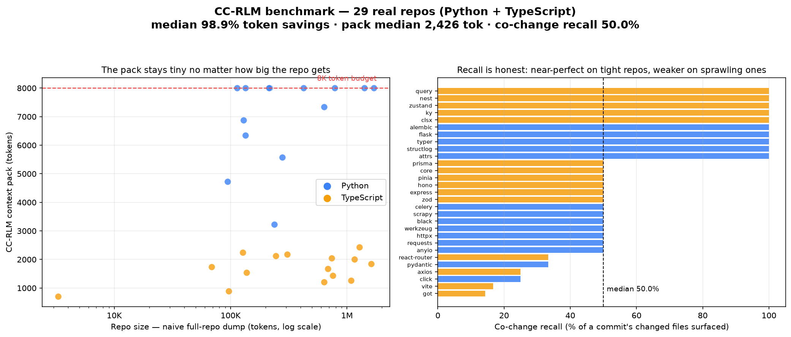

# CC-RLM Multi-Repo Benchmark

A rigorous, reproducible re-test of CC-RLM's token-reduction claim across **29 real open-source repos** (14 Python + 15 TypeScript), using real commits — not hand-picked cases.

## Headline results

| Metric | Result |
|---|---|
| **Median token savings** | **98.9%** (mean 97.4%) vs a naive full-repo dump |
| **Median context pack** | **2,426 tokens** (range 709–8,000) — bounded even on 1.7M-token repos |
| **Median co-change recall** | **50.0%** — near-100% on small/tight repos, 15–33% on large sprawling ones |



## What this measures — and what it doesn't

**Token savings** = `1 − (context pack tokens ÷ naive baseline tokens)`, where the
naive baseline is *every source file of the repo's language*, tokenized with
`tiktoken cl100k_base`. This is the "dump the whole repo into the prompt" behavior
CC-RLM replaces. For large repos this baseline is enormous by design — which is
exactly why you'd never actually do it, and why a bounded pack matters. The
honest, un-gameable takeaway isn't the percentage; it's that **the pack stays
under the 8K budget no matter how large the repo is.**

**Co-change recall** = of the source files a commit changed *together*, how many
did CC-RLM's pack surface? This is a deliberately strict, external ground truth.
It is **not** the same as the original eval's 88% recall, which used 4 hand-curated
cases with expected-file lists. Two honest caveats:
- It counts **test files** that CC-RLM skips by design, so it's a conservative floor.
- Commits often bundle **structurally unrelated** files; CC-RLM surfaces import-graph
  neighbors, not everything that happened to ship in the same commit.

Recall is bimodal: tightly-scoped changes in well-structured repos → near-100%;
large sprawling commits → lower. That's a real, honest limitation, reported as-is.

## Methodology (reproducible)

For each repo:
1. Shallow-clone (`--depth 80`).
2. Compute the naive full-repo token baseline.
3. Seed 5 realistic tasks from recent commits that touched source files
   (task = commit subject, active file = a changed file).
4. For each task: **check out that commit** so `git show HEAD` = the commit's diff —
   this reproduces the real mid-task condition CC-RLM is built for (it seeds
   relevance from your working diff). Clear RLM's cache, call the production
   `/context` endpoint, record pack tokens + which files it included.
5. Savings and recall are per-commit medians.

> **Methodology note:** an earlier version cloned repos with a clean working tree.
> That produced misleading numbers, because CC-RLM seeds context from the *working
> diff* — with no diff, it degrades to slicing just the active file. Checking out
> the target commit fixes this. Measure the tool in the condition it actually runs in.

## Run it yourself

```bash
# 1. start the RLM server
poetry run uvicorn rlm.main:app --port 8081 --host 127.0.0.1
# 2. run the benchmark (all repos, or a subset)
poetry run python bench/run_bench.py
poetry run python bench/run_bench.py --only psf/requests colinhacks/zod
# 3. chart it
poetry run pip install matplotlib
poetry run python bench/chart.py
```

Repo set: [`repos.json`](repos.json). Raw results: [`results/bench_results.json`](results/bench_results.json).

_Benchmark run: 29/30 repos (encode/django-rest-framework clone failed and was skipped)._
